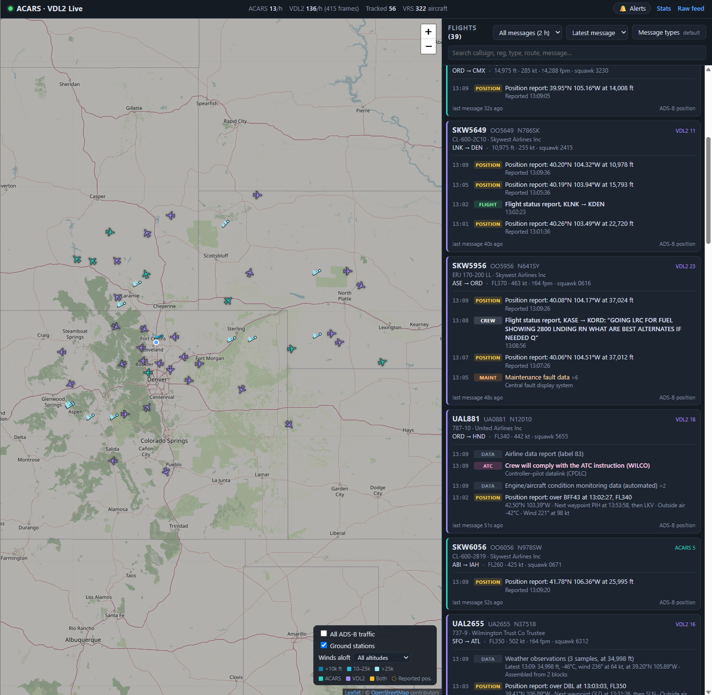
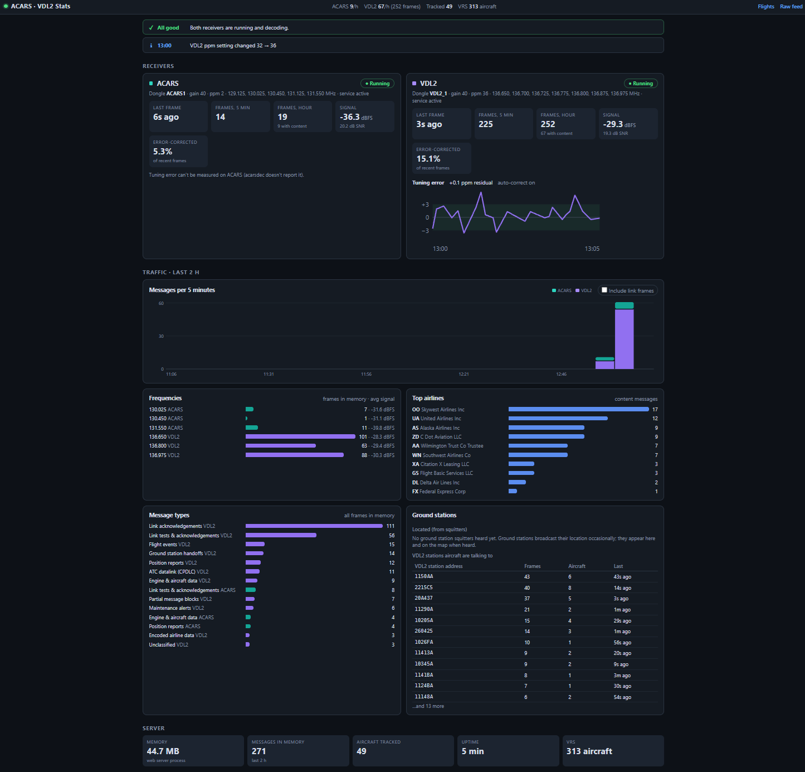
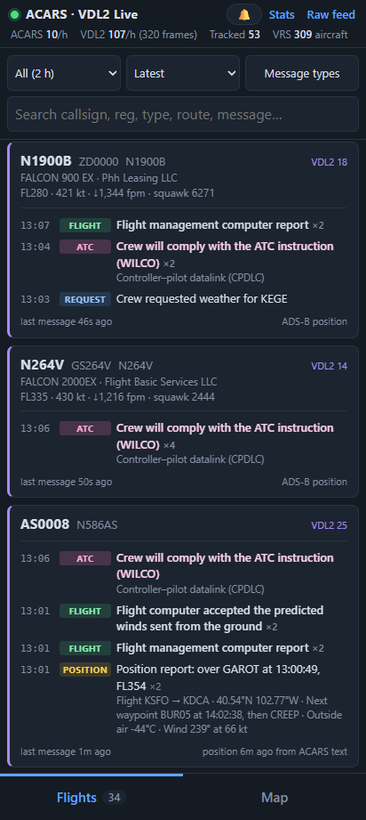
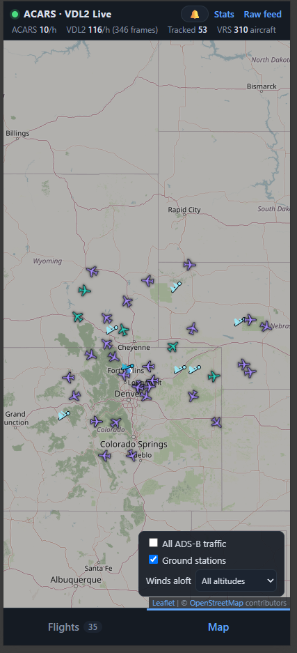

# ACARS · VDL2 Live

A self-hosted ACARS and VDL Mode 2 receiver for a Raspberry Pi (or any Debian machine) with RTL-SDR
dongles. It decodes aircraft datalink messages, translates them into plain English, and shows them on a
live web page: a map, flight cards with message timelines, a raw feed, and a receiver health / stats page.

- **Two receivers at once**: classic VHF ACARS (acarsdec) and VDL2 (dumpvdl2), one dongle each — or [xng](https://github.com/airframesio/xng) for either, chosen in `config.json`.
- **Plain-English translations** of CPDLC, position reports, flight-computer messages, OOOI events,
  weather observations, maintenance alerts, crew/dispatch text and more. Multi-block reports are
  reassembled. Formats that aren't publicly documented (e.g. engine parameters) are named, not guessed.
- **Map** (OpenStreetMap): aircraft with ACARS/VDL2 traffic, optional ADS-B traffic from
  [Virtual Radar Server](https://www.virtualradarserver.co.uk/), positions from messages when there's no
  ADS-B, ground stations, and a winds-aloft layer built from aircraft weather reports.
- **Alerts**: watch list (callsign, flight, registration, ICAO address, prefixes), keywords, crew requests to
  ATC, maintenance alerts and emergency squawks (7500/7600/7700 via VRS).
- **Receiver health**: per-dongle frame rates, signal, error rates, service state, silent-dongle alerts, and
  VDL2 tuning-error (ppm drift) tracking with an optional automatic correction.
- **Phone friendly**: tabbed Flights / Map layout, full-screen flight view.
- **Nothing written to disk**: messages are kept in memory for `history_hours`.



| Receiver health and traffic stats | Phone: flights | Phone: map |
|:---:|:---:|:---:|
|  |  |  |

## Hardware

Tested on a Raspberry Pi 4 (Debian 13) with two RTL2832U/R820T dongles fed from one antenna through an
airband bandpass filter and a splitter.

- **Antenna**: a vertical airband antenna (118–137 MHz). Height matters more than anything else; ground
  stations are rarely heard from low sites, but aircraft at altitude are.
- **Dongles**: one per receiver. TCXO dongles (±1 ppm, e.g. RTL-SDR Blog V3/V4) avoid most tuning drift.
- **USB bandwidth**: all Pi 4 USB ports share one USB 2.0 link. ACARS runs at ~2.5 MS/s; 3.2 MS/s dropped
  ~18% of samples here when another SDR was streaming on the same Pi.

## Install

```bash
git clone https://github.com/egite/E-s-ACARS-Receiver-and-Display.git ACARS && cd ACARS
./install.sh
```

The script installs packages, blacklists the DVB-T TV driver, builds libacars, acarsdec and dumpvdl2 into
`third_party/`, creates `config.json` from `config.example.json`, and installs and starts three systemd
services. Re-running it is safe. Use `./install.sh --no-services` to set up without the services.

Then reboot (or unplug and replug the dongles) so the TV driver blacklist takes effect, and continue below.

## Setting up the dongles

### 1. Give each dongle a unique serial number

Most dongles ship with the same serial (`00000002`), and device numbers (0, 1) can swap between boots.
Writing a unique serial to each dongle's EEPROM lets the config select them reliably.

```bash
sudo systemctl stop acars-decoder@acars acars-decoder@vdl2   # free the dongles
rtl_test -t                                    # list dongles and their current serials
rtl_eeprom -d 0 -r dongle0-backup.bin          # back up first (repeat per dongle)
rtl_eeprom -d 0 -s ACARS1                      # answer 'y'
rtl_eeprom -d 1 -s VDL2_1
```

Unplug and replug the dongles, check with `rtl_test -t`, and put the serials in `config.json`
(`receivers.acars.device`, `receivers.vdl2.device`).

### 2. Measure each dongle's frequency error (ppm)

Cheap dongles are often tens of ppm off, which costs VDL2 most of its messages (here: 91 messages/hour at
−32 ppm uncorrected versus ~56/minute corrected).

- **VDL2 dongle**: start with `"ppm": 0`, open the **Stats** page and wait for *Tuning error* (it needs ~60
  strong VDL2 frames). Set `ppm` to the suggested value and restart the decoder.
- **ACARS dongle**: acarsdec can't measure frequency error, so measure it with dumpvdl2 for a few minutes:

  ```bash
  sudo systemctl stop acars-decoder@acars
  third_party/dumpvdl2/build/src/dumpvdl2 --rtlsdr ACARS1 --gain 40 --correction 0 136975000
  # each message header ends with [x.x ppm]; set "ppm" to minus the typical value (e.g. −2.4 → 2)
  sudo systemctl start acars-decoder@acars
  ```

Frequency error drifts with temperature. The Stats page tracks the VDL2 dongle continuously and warns
when it's off by more than `health.ppm_tolerance`. With `health.auto_ppm` enabled, a drift that persists
for 30 minutes updates `config.json` and restarts the VDL2 decoder automatically (needs passwordless
`sudo systemctl`; otherwise it only warns).

## Configuration (`config.json`)

| Key | Meaning |
|---|---|
| `home.lat`, `home.lon`, `home.name` | Receiver location (map centre, and the sanity limit for positions parsed from messages) |
| `receivers.acars` / `receivers.vdl2` | `enabled`, `decoder` (see below), `device` (serial or index), `gain` (dB or `"auto"`), `ppm`, `frequencies` (MHz), `binary`, `log_file` (decoded text log, `null` = off) |
| `receivers.*.decoder` | Which decoder to run: ACARS takes `"acarsdec"` (default) or `"xng"`; VDL2 takes `"dumpvdl2"` (default) or `"xng"`. Set per receiver, so one can use xng while the other doesn't |
| `receivers.*.xng_binary`, `.sample_rate`, `.demod_effort` | xng only: path to the binary (`null` = find `xng` on `PATH`), capture rate in Hz (`null` = derived from `frequencies`), and `"live"` or `"max"` demod effort |
| `librtlsdr_preload` | Path to a librtlsdr that detaches the DVB driver itself; only needed if a self-built copy in `/usr/local` lacks that (the install script fills it in) |
| `http_host`, `http_port` | Web server address (default `0.0.0.0:8686`) |
| `acars_udp_port`, `vdl2_udp_port` | Local UDP ports the decoders send JSON to |
| `vrs_url`, `vrs_feed`, `vrs_poll_secs` | Virtual Radar Server `AircraftList.json` URL (empty = no VRS), optional feed id, poll interval |
| `history_hours` | How long messages and aircraft are kept in memory |
| `health.silence_minutes` | Alert when a receiver decodes nothing for this long (per receiver) |
| `health.ppm_tolerance`, `health.auto_ppm` | Tuning-error warning threshold (ppm) and automatic correction on/off |
| `max_position_km` | Ignore positions parsed from messages that are farther than this from `home` |

**Choosing a decoder.** `acarsdec` and `dumpvdl2` are the defaults and need no extra setup — `install.sh`
builds them. [xng](https://github.com/airframesio/xng) is an alternative that covers *both* modes in one
permissively-licensed binary (Apache-2.0/MIT, against acarsdec's GPL-2.0 and dumpvdl2's GPL-3.0), and in
testing here it decoded noticeably more than acarsdec on the same antenna. It is not built by `install.sh`;
install the `.deb` from its releases page, then set `"decoder": "xng"` and restart that receiver.

The trade is CPU. xng's per-mode pipeline is single-threaded, so what matters is single-core speed, not
core count — extra cores do not help. Measured here: acarsdec runs 5 ACARS channels at about 11% of one
core, where xng needs roughly 70% of one core on a 2015 i7-5500U, and saturates a Raspberry Pi 4 entirely.
Check for `stream read: Overflow` in the decoder's log after switching; if you see it, the CPU can't keep
up — drop a channel or go back to acarsdec.

One xng caveat: `sample_rate` is derived automatically only for ACARS — for VDL2 you must set it
explicitly, because xng's VDL2 channel rate isn't documented. `ppm` *is* honoured: xng has no RTL-SDR
ppm option, so `receiver.py` pre-compensates by scaling the centre frequency and the channel list by
`1/(1 + ppm/1e6)`, which lands the dongle on the true frequencies. (Scaling only the centre would leave
every channel off by roughly `centre × ppm`; scaling both leaves an error of only `offset × ppm`, about
2 Hz at the edge of a 2.4 MHz capture.)

**Frequencies.** The defaults are the common US channels. ACARS channels must fit within ~2.4 MHz (one
dongle's bandwidth); VDL2 channels within ~1 MHz. Europe uses different ACARS channels (e.g. 131.525,
131.725, 131.825) and mostly VDL2 136.975 plus local channels. The Stats page shows traffic per frequency.

After changing receiver settings: `sudo systemctl restart acars-decoder@acars acars-decoder@vdl2`.
`health` settings are picked up automatically within 30 seconds; anything else needs `sudo systemctl restart acars-web`.

## Running

```bash
systemctl status acars-web acars-decoder@acars acars-decoder@vdl2
journalctl -u acars-decoder@vdl2 -f              # decoder log
sudo systemctl restart acars-web
```

Services start at boot and restart automatically if they exit. To watch decoded text in a terminal, stop
a decoder's service and run `./run_acars.sh` or `./run_vdl2.sh` instead.

### Web pages

- **`/`** — map and flight cards. Click a card or aircraft to open its message history; *Message types*
  chooses which kinds of messages to show; *Alerts* sets up the watch list and keywords.
- **`/stats`** — receiver health, traffic over time, frequencies, airlines, message types, ground stations.
- **`/raw`** — every decoded frame as it arrives, with the original JSON and an optional translation.

Settings (filters, message types, alerts) are saved per browser. Alerts show on the page while it's open;
desktop notifications would need the page served over HTTPS.

## How translation works

`web/translate.py` turns each message into a category, a one-line English summary and details. It covers
CPDLC (via libacars), ARINC 702 flight-computer messages, many airline position/weather/OOOI formats,
labels 44/80/4A/4T/B9/5U/QQ/SQ/SA and others. Airline monitoring reports are identified (report number,
route, flight phase) but their numeric contents aren't publicly documented and are left untranslated.
`web/server.py` reassembles multi-block reports (same message number, letter suffix).

`tests/corpus.jsonl` holds ~7,500 real decoded messages for checking translation changes, e.g.:

```bash
cd web && python3 - <<'EOF'
import json, translate
msgs = [json.loads(l) for l in open("../tests/corpus.jsonl")]
generic = sum(1 for m in msgs if m["kind"] == "acars" and translate.translate(m).get("generic"))
print(f"{generic} messages without a specific translation (counted before block reassembly)")
EOF
```

## Troubleshooting

- **`usb_claim_interface error -6`** — the DVB-T driver holds the dongle. Reboot after installing (the
  blacklist), or set `librtlsdr_preload` to the distro librtlsdr.
- **`[R82XX] PLL not locked!`** at startup — harmless.
- **VDL2 decodes very little** — almost always tuning error; see *Measure each dongle's frequency error*.
- **No ground stations on the map** — they appear only when their occasional squitter broadcast is heard.
- **Dropped samples / nothing decodes at higher sample rates** — USB bandwidth shared with other SDRs.

## Project layout

```
config.example.json    settings template (install.sh copies it to config.json, which git ignores)
receiver.py            starts acarsdec / dumpvdl2 / xng from config.json
install.sh             packages, builds, config, services
systemd/               service templates (installed by install.sh)
web/server.py          ingest, reassembly, aircraft tracking, VRS, WebSocket and APIs
web/translate.py       plain-English translation and message types
web/monitor.py         receiver health, ground stations, weather observations, stats
web/static/            the web pages
tests/corpus.jsonl     real messages for translation testing
screenshots/           images for this README
third_party/           acarsdec, dumpvdl2, libacars (created by install.sh, not in git)
```

## Credits

This project stands on the work of others. Thank you to the authors and contributors of:

**Decoding and radio**

- [acarsdec](https://github.com/f00b4r0/acarsdec) (GPL-2.0): VHF ACARS decoder, originally written by
  [Thierry Leconte](https://github.com/TLeconte/acarsdec) and maintained by Thibaut Varène (f00b4r0).
- [dumpvdl2](https://github.com/szpajder/dumpvdl2) (GPL-3.0): VDL Mode 2 decoder, by Tomasz Lemiesz (szpajder).
- [xng](https://github.com/airframesio/xng) (Apache-2.0 / MIT): optional multi-mode decoder covering both
  ACARS and VDL2, by Airframes.io. Not installed by `install.sh`; selected with `receivers.*.decoder`.
- [libacars](https://github.com/szpajder/libacars) (MIT): ACARS, CPDLC, ADS-C and MIAM parsing used by both
  decoders, also by Tomasz Lemiesz.
- [rtl-sdr / librtlsdr](https://osmocom.org/projects/rtl-sdr/wiki) (GPL-2.0), from Osmocom: the dongle
  driver library and the `rtl_test` / `rtl_eeprom` tools used during setup.

**Message formats**

- [acars-decoder-typescript](https://github.com/airframesio/acars-decoder-typescript) (MIT) and
  [acars-message-documentation](https://github.com/airframesio/acars-message-documentation) by
  [Airframes](https://airframes.io/): several message layouts in `web/translate.py` follow their work.

**Web display**

- [aiohttp](https://github.com/aio-libs/aiohttp) (Apache-2.0): web server, WebSocket and HTTP client.
- [Leaflet](https://leafletjs.com/) (BSD-2-Clause): the map.
- Map data and tiles © [OpenStreetMap](https://www.openstreetmap.org/copyright) contributors (ODbL), used
  under the OSM [tile usage policy](https://operations.osmfoundation.org/policies/tiles/).
- [Virtual Radar Server](https://www.virtualradarserver.co.uk/), by Andrew Whewell: optional ADS-B
  aircraft positions and details, read from its `AircraftList.json`.

## License

No rights reserved. This project is dedicated to the public domain under
[CC0 1.0 Universal](LICENSE): copy, modify, use and share it for any purpose, commercial or not, without
asking and without attribution.

This covers the code in this repository. The software that `install.sh` downloads or installs (acarsdec,
dumpvdl2, libacars, rtl-sdr, aiohttp, Leaflet) keeps its own license, listed above, and map tiles remain
© OpenStreetMap contributors.
